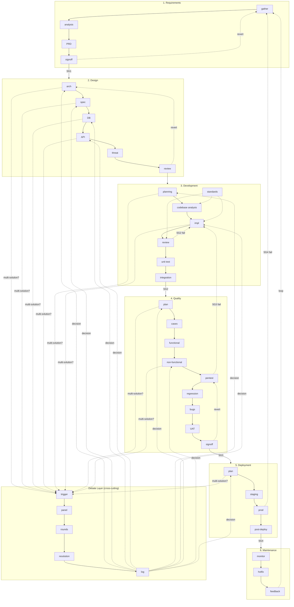

# CrewMarkdown — Router (Deprecated)

> **DEPRECATED**: This file is the old **flow-based** router (33-step pipeline).
> The system has moved to **objective-based** routing.
>
> **Use `00-objectives.md` instead** — maps requests to objectives with role squads.
>
> Old step files (req/gather, design/arch, etc.) are preserved as **procedure references**
> used by roles when executing objectives. See `00-roles.md` for the role→step mapping.
>
> Light variant users: see `light/00-router.md` for the 7-step flow (kept for small projects).

## Before Starting

**1. Codebase Map** — If `codebase-map.md` exists at project root, read it first.
Gives full directory tree + file descriptions + exports. Agent uses it to navigate
without searching. Regenerate with: `.crewmarkdown\scripts\generate-codebase-map.ps1`

**2. Custom Instructions** — Before running any step, check `.crewmarkdown/custom/<phase>.md`.
If file has content, inject as additional context. Empty file = skip.

| Phase | Custom File |
|-------|-------------|
| Requirements | `.crewmarkdown/custom/01-requirements.md` |
| Design | `.crewmarkdown/custom/02-design.md` |
| Development | `.crewmarkdown/custom/03-development.md` |
| QA | `.crewmarkdown/custom/04-qa.md` |
| Deployment | `.crewmarkdown/custom/05-deployment.md` |
| Maintenance | `.crewmarkdown/custom/06-maintenance.md` |

**3. Logging** — Each step writes a log to `.crewmarkdown/log/<year>/<month>/<day>/<index>-<stepId>-<timestamp>.md` (WordPress-style date hierarchy). Use `.crewmarkdown/scripts/write-workflow-log.ps1` (or `write-workflow-log.sh`) to write logs.
State is tracked in `.crewmarkdown/state/workflow.json` (current step, completed steps with
timestamps, phase gates). On resume, agent reads state + last log for context.

**4. Validation** — Run `.crewmarkdown/scripts/validate-workflow.ps1` (or `.sh`) to check cross-references,
step IDs, and state file integrity before starting work.

**5. Variant Selection** — Use `00-objectives.md` (objective-based) by default.
For small projects / MVPs, use `.crewmarkdown/light/00-router.md` (7-step light variant).

---

## Request → Objective (see `00-objectives.md` for authoritative routing)

For reference, old step routing is preserved below. New code should use `00-objectives.md`.

## Request → Step (legacy reference)

| Request | Start Step | ID |
|---------|-----------|-----|
| "Build feature" / email/chat/ticket | Requirements Intake | req/gather |
| "Write PRD" | PRD | req/prd |
| "Debate decision" / "Multiple solutions" / "Run debate" | Debate Trigger | debate/trigger |
| "Resolve disagreement" / "Choose approach" | Debate Trigger | debate/trigger |
| "Design system" / "Architecture" | System Architecture | design/arch |
| "Tech spec" | Technical Spec | design/spec |
| "DB design" | Database Design | design/db |
| "API design" | API Design | design/api |
| "Security review" / "Threat model" | Threat Modeling | design/threat |
| "Review design" | Design Review | design/review |
| "Plan sprint" | Sprint Planning | dev/planning |
| "Modify existing project" / "Add feature to existing code" | Codebase Analysis | dev/analysis |
| "Implement X" / "Write code" | Implementation | dev/impl |
| "Review code" / "PR" | Code Review | dev/review |
| "Write tests" | Unit Testing | dev/unit |
| "Integration / CI" | Integration | dev/integration |
| "Test plan" | Test Planning | qa/plan |
| "Test cases" | Test Case Dev | qa/cases |
| "Run tests" | Functional Testing | qa/functional |
| "Performance test" | Non-Functional Testing | qa/nonfunctional |
| "Pentest" / "Security audit" | Security Pentest | qa/pentest |
| "Regression" | Regression | qa/regression |
| "Bug found" | Bug Tracking | qa/bugs |
| "UAT" | UAT | qa/uat |
| "QA sign-off" | QA Sign-off | qa/signoff |
| "Release plan" | Release Planning | deploy/plan |
| "Deploy staging" | Staging Deploy | deploy/staging |
| "Deploy prod" | Production Deploy | deploy/prod |
| "Post-deploy / monitor" | Post-Deployment | deploy/post |
| "Monitoring setup" | Monitoring & Observability | ops/monitor |
| "Hotfix" / "Prod down" | Hotfix Process | ops/hotfix |
| "Feedback / improvement" | Feedback Loop | ops/feedback |

No match? → Ask "Which SDLC phase does this belong to?"

## Debate Integration

Debate is a **cross-cutting sub-workflow**, not a fixed phase. It activates at any decision point where multiple viable solutions exist.

### When to activate
- **Design phase:** Tech stack, architecture fork, DB engine — debate before design review
- **Development phase:** Implementation approach, library choice — debate before coding
- **QA phase:** Test framework choice, automation strategy — debate before test planning
- **Deployment phase:** Rollout strategy, rollback plan — debate before staging

### How to activate
1. Decision point reached in any step
2. Agent asks: "Is there a clear single best solution, or should we debate?"
3. If multiple viable options → run `debate/trigger`
4. After debate resolution → resume parent step with winning option

### Sub-workflow steps
| ID | File |
|----|------|
| debate/trigger | debate/01-debate-trigger.md |
| debate/panel | debate/02-debate-panel.md |
| debate/rounds | debate/03-debate-rounds.md |
| debate/resolution | debate/04-debate-resolution.md |
| debate/log | debate/05-debate-log.md |

## Security Gates

| Gate | Before | Must Pass |
|------|--------|-----------|
| SG1 | Design review | Threat model complete, High threats mitigated |
| SG2 | Merge to main | SAST + secret + dep scan clean |
| SG3 | QA sign-off | DAST + pentest no Critical/High |
| SG4 | Production deploy | All scans clean, no Critical/High bugs |

## Steps Index

### Requirements (4)
| ID | File | 
|-----|------|
| req/gather | procedures/01-requirements/01-requirements-gathering.md |
| req/analysis | procedures/01-requirements/02-requirements-analysis.md |
| req/prd | procedures/01-requirements/03-prd.md |
| req/signoff | procedures/01-requirements/04-requirements-review-and-signoff.md |

### Design (6)
| ID | File |
|-----|------|
| design/arch | procedures/02-design/01-system-architecture.md |
| design/spec | procedures/02-design/02-technical-specification.md |
| design/db | procedures/02-design/03-database-design.md |
| design/api | procedures/02-design/04-api-design.md |
| design/threat | procedures/02-design/06-threat-modeling.md |
| design/review | procedures/02-design/05-design-review.md |

### Development (7)
| ID | File |
|-----|------|
| dev/planning | procedures/03-development/01-sprint-planning.md |
| dev/analysis | procedures/03-development/02-codebase-analysis.md |
| dev/standards | procedures/03-development/03-coding-standards.md |
| dev/impl | procedures/03-development/04-implementation.md |
| dev/review | procedures/03-development/05-code-review.md |
| dev/unit | procedures/03-development/06-unit-testing.md |
| dev/integration | procedures/03-development/07-integration.md |

### QA (9)
| ID | File |
|-----|------|
| qa/plan | procedures/04-qa/01-test-planning.md |
| qa/cases | procedures/04-qa/02-test-case-development.md |
| qa/functional | procedures/04-qa/03-functional-testing.md |
| qa/nonfunctional | procedures/04-qa/04-non-functional-testing.md |
| qa/regression | procedures/04-qa/05-regression-testing.md |
| qa/bugs | procedures/04-qa/06-bug-tracking.md |
| qa/uat | procedures/04-qa/07-uat.md |
| qa/pentest | procedures/04-qa/09-security-pentest.md |
| qa/signoff | procedures/04-qa/08-qa-signoff.md |

### Deployment (4)
| ID | File |
|-----|------|
| deploy/plan | procedures/05-deployment/01-release-planning.md |
| deploy/staging | procedures/05-deployment/02-staging-deployment.md |
| deploy/prod | procedures/05-deployment/03-production-deployment.md |
| deploy/post | procedures/05-deployment/04-post-deployment.md |

### Maintenance (3)
| ID | File |
|-----|------|
| ops/monitor | procedures/06-maintenance/01-monitoring-and-observability.md |
| ops/hotfix | procedures/06-maintenance/02-hotfix-process.md |
| ops/feedback | procedures/06-maintenance/03-feedback-loop.md |

### Debate (5 — Cross-Cutting Sub-Workflow)
| ID | File |
|----|------|
| debate/trigger | debate/01-debate-trigger.md |
| debate/panel | debate/02-debate-panel.md |
| debate/rounds | debate/03-debate-rounds.md |
| debate/resolution | debate/04-debate-resolution.md |
| debate/log | debate/05-debate-log.md |

## Chain — Full Flowchart



Rendered 33-step chain + debate sub-workflow. Solid arrows = forward. Dotted arrows = revert/fail.
Dashed into debate = trigger when multiple solutions exist. Dashed out of debate = decision feeds back.

## Phase Transitions

| Phase | Advance → | Revert → (if fail) | Debate Trigger |
|-------|-----------|-------------------|----------------|
| Req → Design | req/signoff → design/arch | Back to req/gather | Priority/scope disputes |
| Design → Dev | design/review → dev/planning | Back to design/review or design/threat | Tech stack, architecture forks |
| Dev → QA | dev/integration → qa/plan | Back to dev/impl | Implementation approach |
| QA → Deploy | qa/signoff → deploy/plan | Back to dev/impl or qa/pentest | Test strategy, automation |
| Deploy → Maintenance | deploy/post → ops/monitor | Back to dev/impl (hotfix) | Rollout strategy |
| Maintenance → Req (loop) | ops/feedback → req/gather | — | Refactor vs rewrite |

## Debate Sub-Workflow Sequence

When debate is triggered, run in sequence:

```
trigger → panel → rounds → resolution → log → return to parent step
```

The debate sub-workflow is synchronous — parent step pauses, debate runs, decision feeds back.
